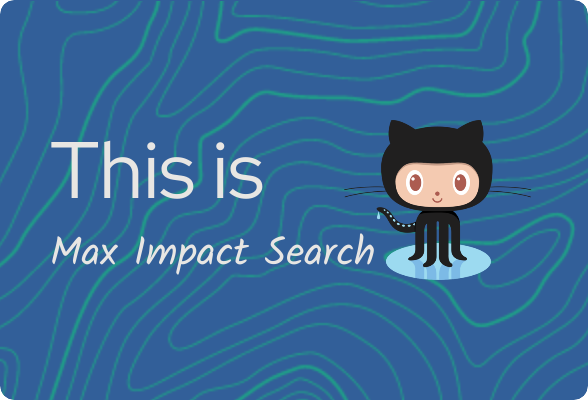

 
<b>Opens multiple different impact search engines at once</b>

- ⚡ [Start the Search Engine](https://llarryyllarryy.github.io/Max-Impact-Search/?)
- ⚡ [Start Donating for Free](https://llarryyllarryy.github.io/nocostdonate/)

  

<!-- Markdown -->

- 🔭 I’m currently working on [Actionable Thinking Podcast](https://imdb.com/title/tt19849624/)

- 🤝 I’m looking for help with [How to Make Positive Change without Spending Money](https://www.wikihow.com/Make-Positive-Change-without-Spending-Money)

- 📝 I regularly write articles on [http://llarryysblog.tumblr.com](http://llarryysblog.tumblr.com)

<h3 align="left">Connect with me:</h3>

<h3 align="left">Languages and Tools:</h3>

     

