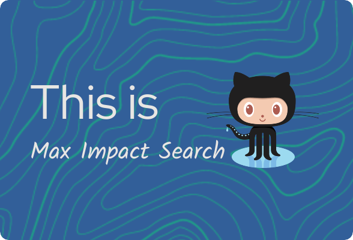

 
<b>Opens multiple different impact search engines at once</b>

- ⚡ [Start the Search Engine](https://llarryyllarryy.github.io/Max-Impact-Search/?)
- ⚡ [Start Donating for Free](https://llarryyllarryy.github.io/nocostdonate/)
- ⚡ Download Android App: [Playstore](https://play.google.com/store/apps/details?id=com.larry.maximpactsearch) | [Github](https://github.com/llarryyllarryy/Max-Impact-Search/raw/main/androidapp/bin/app-release.apk)

- if you dont like the design you can use this page [Groovia](https://github.com/Noorendra9778/Groovia/blob/main/README.md)

- ⚡ [Book Summary Page](https://wowtop.eu/test/book/index.php)
- ⚡ [Blog Aggregator](https://aggregator.base44.app/)

<!-- Markdown -->

- 🔭 I’m currently working on [Actionable Thinking Podcast](https://imdb.com/title/tt19849624/)

- 🤝 I’m looking for help with [How to Make Positive Change without Spending Money](https://www.wikihow.com/Make-Positive-Change-without-Spending-Money)

- 📝 I regularly write articles on [http://llarryysblog.tumblr.com](http://llarryysblog.tumblr.com)

- [Online Radio](https://station.voscast.com/62927054b6621/) for [Youtube](https://www.youtube.com/channel/UCyc2T7knpQdlopgfMCwR_eA/playlists) or [Spotify](https://open.spotify.com/user/313iaxo6czaeitorqteioznc5zty?si=hmcEMAH5SvqMP2mdWP7gBg)

<h3 align="left">Connect with me:</h3>

<h3 align="left">Languages and Tools:</h3>

     

